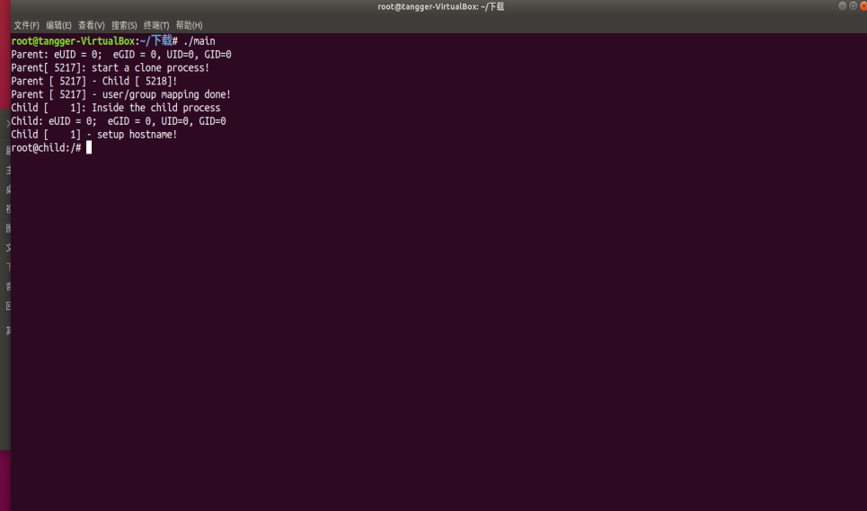
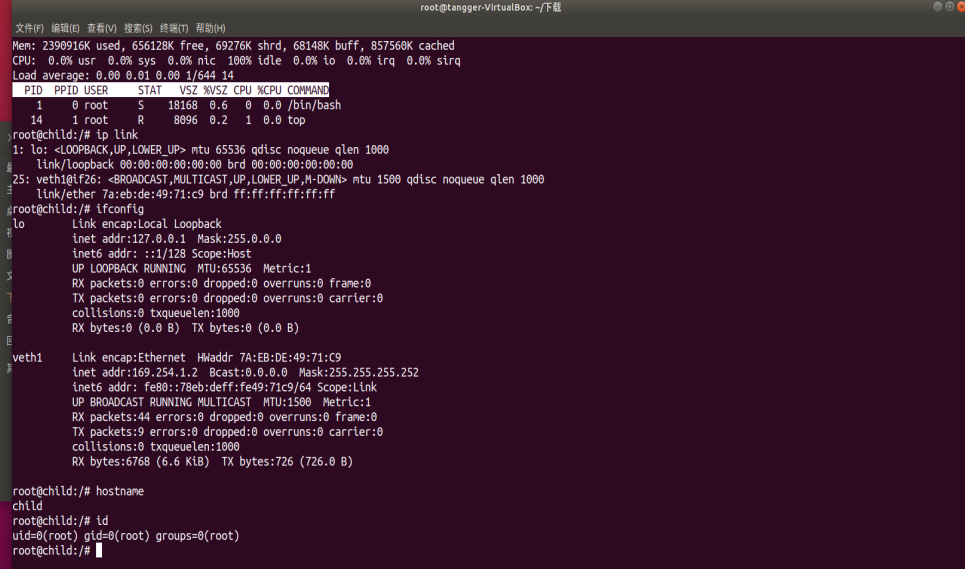

# SimpleContainer说明文档

## 一、环境依赖

（一）运行环境

经测试ubuntu14、16、18都没有问题

（二）依赖

需要gcc  

需要系统的root权限（网络隔离需要root权限）

## 二、程序功能说明

一、实现了UTS、Mount、IPC、PID、NETWORK、User共六种隔离，同时，我为这个小小的容器，弄了一个独立的文件系统，在容器环境中，无权访问宿主机的其他文件夹（除映射的几个文件夹以外）

二、在k4ii提供的文件系统基础上，添加了更多的文件支持，经过测试，基本上常用的命令都能实现。你可以理解为我为这个容器装载了一个镜像。

## 三、使用说明

### 使用流程

一、下载main.c主程序和rootfs.tar.gz

二、将rootfs.tar.gz移动到系统根目录，注意必须是“/”这个目录

三、将rootfs.tar.gz解压，然后，在 / 目录看到了一个rootfs的文件夹（如果不行，记得用chmod赋予权限）

四、确保系统有gcc，然后编译main.c

五、授予root权限（sudo -s）

六、启用./main程序

### 说明

因为main.c文件内默认的rootfs文件路径是/rootfs，所以，在不修改源代码的情况下，我希望你将rootfs.tar.gz解压在根目录。至于main.c放在哪儿，你看哪儿顺手就放哪儿吧。

## 四、致谢

超链接不分先后！

[酷壳：DOCKER基础技术：LINUX NAMESPACE（上）](https://coolshell.cn/articles/17010.html)

[yadutaf：Introduction to Linux namespaces](https://blog.yadutaf.fr/2014/01/12/introduction-to-linux-namespaces-part-4-ns-fs/)

[子厚.：容器基础(二): 使用Namespace进行边界隔离](https://www.cnblogs.com/aios/p/10035923.html)

[oolap：Linux 容器技术-学习笔记](http://www.oolap.com/linux-container-tech)

[李乾坤：《自己动手写docker》笔记](https://qiankunli.github.io/2018/05/13/write_docker_self_note.html)

[知乎专栏：Win10+WSL+VS Code搭建Ubuntu开发环境](https://zhuanlan.zhihu.com/p/57882542)

[侯云海：namespace资源隔离](https://www.ihaiyun.cc/2018/07/21/Docker-namespace/)

[Workspacce of Lionheart：Docker资源隔离和限制实现原理](http://lionheartwang.github.io/blog/2018/03/18/dockerzi-yuan-ge-chi-he-xian-zhi-shi-xian-yuan-li/)

[10条：mount namespace和共享子树](http://www.10tiao.com/html/606/201810/2664605819/1.html)

[Infoq：Docker 背后的内核知识——Namespace 资源隔离](https://www.infoq.cn/article/docker-kernel-knowledge-namespace-resource-isolation)

## 五、感想

首先，感谢k4ii在这一年里对我的帮助，我需要帮助的时候去找k4ii，他总能给我一些解决方案。

其次，感谢红岩网校SRE的每位同学和学长，大一这一年给了我很多的支持和包容。在SRE，学到了很多的东西（其实不多，因为我很懒）。我也不晓得，这次考核能不能过，过了就留下，没过也没啥，事实上我对自己写出来的东西信心不大，但是，我基本上尽力了。

刚开始写uts、ipc隔离的时候很顺畅，后来我在mount和chroot上面卡了一天，四处爬贴，翻博客，就这样坐在电脑面前搞了一天，不幸的是，我还是没明白，那些博客都说mount就行了，行尼玛！当我阅读了《自己动手写docker》后我才知道问题在哪！

上面的那些链接指向的文章，我基本上都拜读了，酷壳上面有现成的代码不假，可就像我给k4ii说的那样，不留后路，干他娘的！我希望自己写的更好，哪怕不行，我也要比别人多明白一点儿。

（臭美）我努力的样子，其实还不坏~

## 六、容器截图

